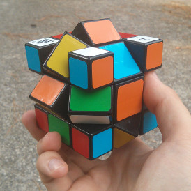
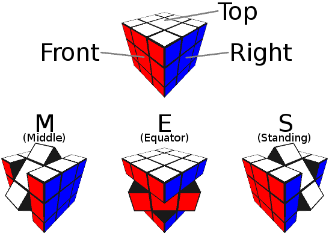

Finds the shortest solution to a scrambled 3x3x3 Mixup cube.

The 3x3x3 Mixup cube is a variant of the 3x3x3 Rubik's cube twisty puzzle. It's
a super fun puzzle to solve, so you should get one and try to solve it on your
own! Unlike a traditional Rubik's cube, the Mixup cube allows a slice to be
twisted 45 degrees, which can move edges to places normally occupied by faces,
and vice versa.

This program is conceptually based on this [optimal
solver](https://github.com/brownan/Rubiks-Cube-Solver/) for the Rubik's cube,
which is in turn based on the paper "Finding Optimal Solutions to Rubik's Cube
Using Pattern Databases", by Richard E Korf of UCLA.

Usage
=====

First, you'll need:
 * Linux
 * C compiler - gcc and clang are tested, but others should work.
 * Make
 * Python 3.2 or greater
 * Python 3 OpenGL bindings

Compile the C library using Make:

    $ make

Right now the only user interface is "viewer.py", which displays the puzzle
after a sequence of moves:

    $ python3 viewer.py "MU'M'R2"

Status
======

The program can solve the puzzle when it's not too far away from the solved
state. There is still a lot of work to do on optimization. It takes my computer
over 3-4 minutes to solve a cube that is 6 away from the solution.

The python interface works well. The only user facing program is "viewer.py",
which you can use to manipulate the cube and solve a given state. The interface
definitely needs some work to be easy to use though.

Notation
========

The usual Rubik's cube face turns are pretty standard. By default, they are
clockwise 90 degree turns. Adding an apostrophe ('), pronounced "prime", means
a counter-clockwise turn. Adding a 2 after means a 180 degree turn. These
letters also identify the 6 faces of the cube.
* L - Left
* R - Right
* U - Up
* D - Down
* F - Front
* B - Back

The slice moves, M, E and S, are all 45 degree turns, moving pieces from edge
slots to face slots and vice versa. They are best explained by picture:

Or if you prefer description:
* M - Middle - Move the slice between L and R faces. The top comes towards the
    front face. The cubie in the UF slot will now be in the F slot.
* E - Equator - Move the slice between U and D faces. The left comes towards
    the front face. The cubie in the FL slot will now be in the F slot.
* S - Standing - Move the slice between F and B faces. The top comes towards
    the right face. The cubie in the UR slot will now be in the R slot.
